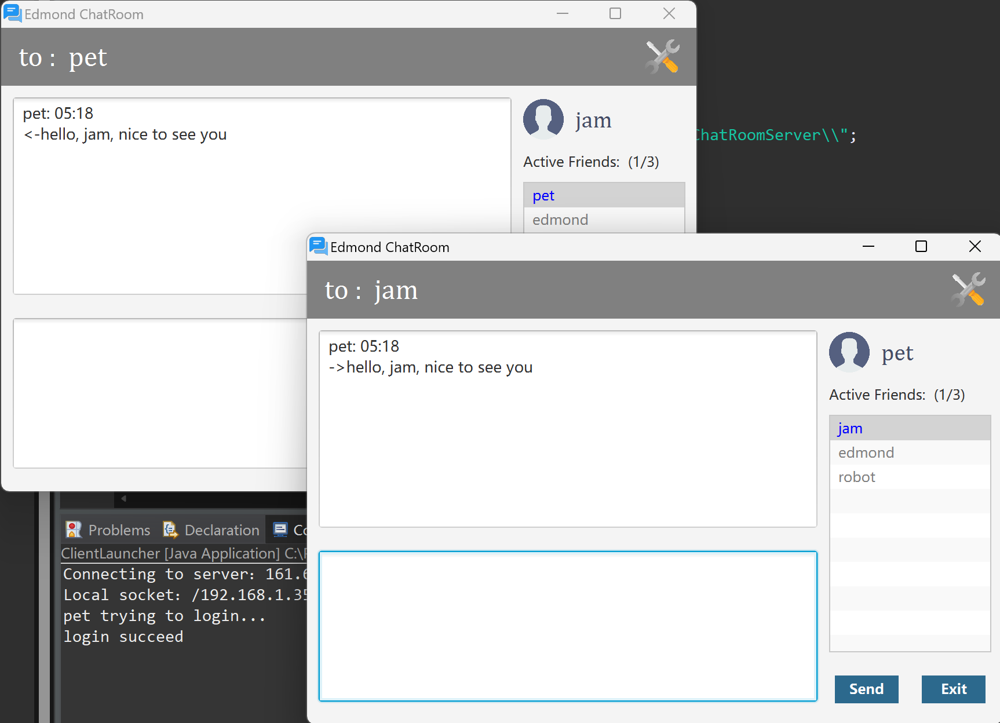

# Edmond Chat Room 
## Introduction:
This is an assignment of **SWEN504 Security & Cloud.**   
It's an instant messaging system that allows multiple users to login at the same time and send point to point messages between each other through the server. The message will be presented on the peer user's client UI and stored in the database in encrypted/plain text according to the user's settings. The server is responsible for authenticating users, reading/writing databases, forwarding user messages, online user management, on/offline notifications, etc. The client is responsible for the generating and managing user's symmetric key, the front-end validation of the user's input, and the display and management of the friend list. Encryption of sensitive information is achieved throughout the communication process, and security requirements are maximized in static storage.   
Please check the YouTube video for demonstration:  
[Chat Room Demonstration](https://www.youtube.com/watch?v=6Oa8CeEawFI)

## Snapshot

## Features
- server and client architecture.
- multi-thread server.
- communication through TCP protocol.
- SSL login mechanism (Symmetric & Asymmetric encryption)
- support RSA, AES, DES
- support multi-user sending message between each other
- friends list display on login
- friends online/offline notice
- password storage on database in MD5
- input validity check and anti SQL inject attack
- securely save/load keys and settings to/from a local file system.
- allow users to store encrypted messages in the database.

## Tech Stack 
| Type | Name |
| ----------- | ----------- |
| Framework | Java FX |
| Programming Language | Java |
| Database   | MySQL |

## Library
- gson v2.9.1
- mysql-connector-j v8.2.0

## Run Instruction
The server application is already running in my private cloud. The server's address is hard coded in client app, So user only need to run the client app.
### Requirement:
- Java Runtime Environment
- Java FX
### Steps:   
To run the application in your local machine, please follow the steps below:
1. Clone the repository from the github  
2. Add the following .jar file into build path.
>- gson
>- mysql-connector-j
3. Run the *ClientLauncher.java* in the *application* package.

### Test Account:
| Username | Password |
| ----------- | ----------- |
| jam | jam |
| pet | pet |
| edmond | edmond |

## API Design
| API |	From |	To | Trigger Condition | Payload| 
| ------- | -----| --- | ---------------- | ------------------------ |
| public_key | client | server | If server's public key does not exist in client's end | username |
| key_delivery |server | client	| When server receives the public_key request |	public key |
| validate | client	| server | When client receives the public key from server | **username, password, algorithm type, key** | 
| user_already_online | server|client|If a user has already logged in| null|
| invalid_combination | server| client | If the user name and password don’t match| null |
| login_succeed | server | client| If the user name and password match| **token, message  encrypted, friends list** |
| user_message | client | server | User-initiated chat messages when peer user is on line | **token, source user, destination user, message** | 
| paging| server | client | when server received the user_message | **source user, destination user, message** |
| enable_encrypt_message | client | server | When user enabled the encryption setting | **password** |
| disable_encrypt_message | client | server | When user disabled the encryption setting | null |
| log_out | client | server | When a logged-in user exit or close the app | null |
| give_up | client | server | When a client exit or close the app, who has just established a connection to the server, but has not yet successfully logged in. | null |

*bold text means encrypted value during transmission.

## License
MIT